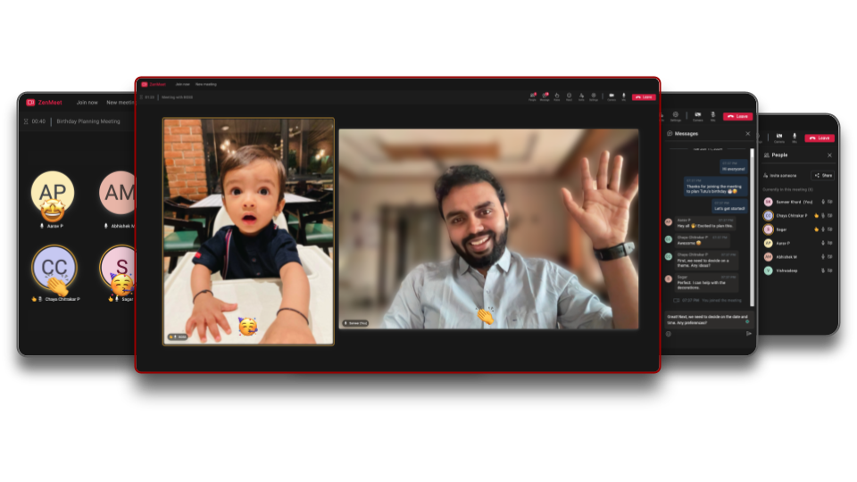
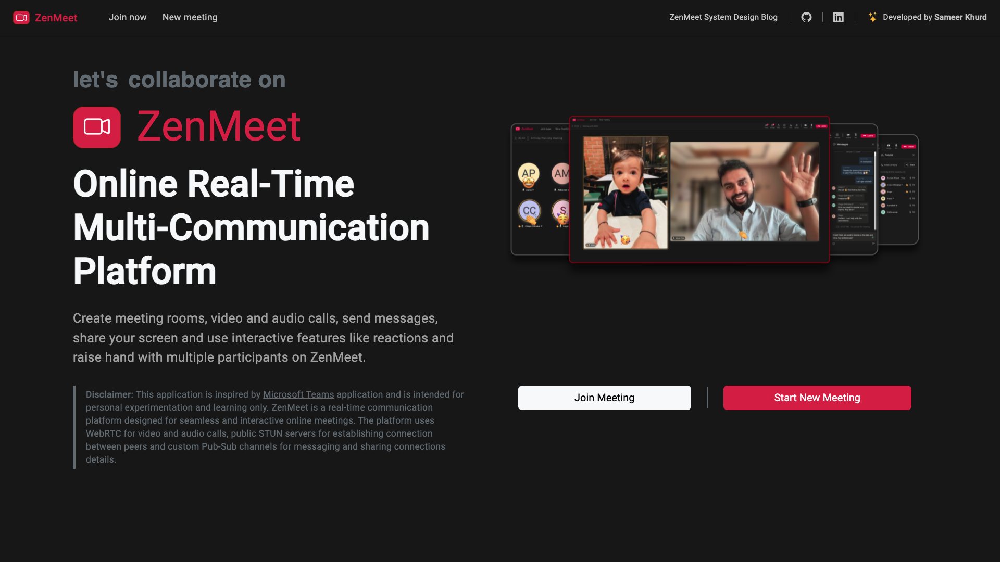
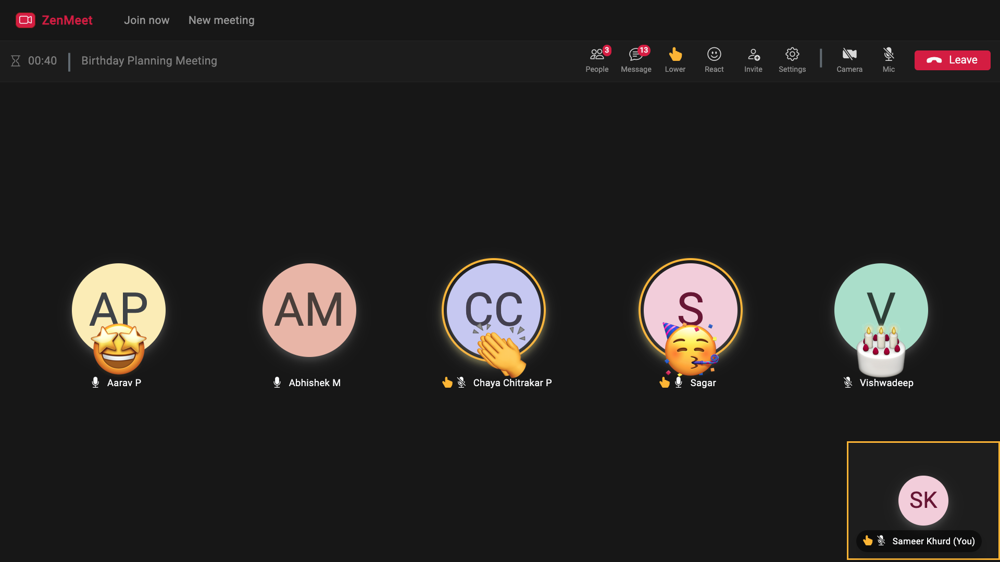
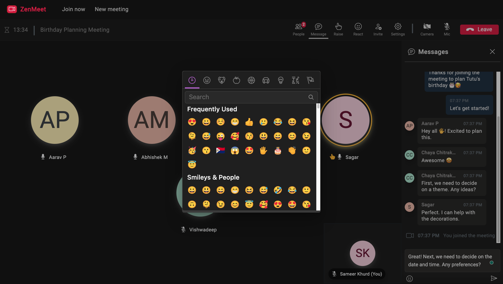
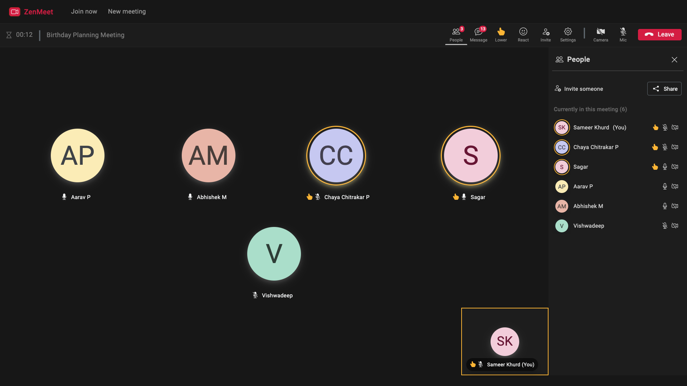

# ZenMeet : Online Video Conferencing Platform [Full Stack]

## Overview

This repository contains the codebase for a online real-time multi-communication video conferencing platform **ZenMeet**, inspired by applications like Microsoft Teams, Zoom, Google Meet. ZenMeet is designed to facilitate seamless and interactive online meetings with features to create meeting rooms, make video and audio calls, messaging, screen sharing, and interactive controls like reactions and hand-raising.
The platform uses WebRTC for video and audio calls, public STUN servers for establishing connection between peers and custom Pub-Sub channels for messaging and sharing connections details.
<br />

### Demo

Checkout&nbsp; [Live Demo : &nbsp;zenmeet.web.app ](https://zenmeet.web.app/)

### System Design Blog

For a detailed explanation of the system design and implementation, checkout [System Design Blog](/).

<br />



## Contents

- [Overview](#overview)
- [Demo](#demo)
- [System Design Blog](#system-design-blog)
- [Technology Stack](#technology-stack)
- [App Setup](#app-setup)
- [Deployment](#deployment)
- [Contributing](#contributing)
- [Screenshots](#screenshots)

## Technology Stack

- **Web App**: Angular, Bootstrap 5
- Custom Pub-Sub channels
- GCP Firestore (NoSQL) Database
- Firebase Hosting
- Web-sockets
- WebRTC peer connections

## App Setup

### Prerequisites

- Node.js ([Version 20.9.0](https://nodejs.org/en/blog/release/v20.9.0))
- npm ([Version 10.1.0](https://www.npmjs.com/package/npm/v/10.1.0))
- Angular CLI ([Version 16.2.14](https://www.npmjs.com/package/@angular/cli/v/16.2.14))
- Git ([Download](https://git-scm.com/downloads))
- Firebase Firestore database setup for the project

### Installation

1. Clone the repository:
   ```sh
   git clone https://github.com/SameerKhurd/zen-meet.git
   ```
2. Install app dependencies:
   ```sh
   cd frontend/zen-meet-web-app
   npm install
   ```

### Running Locally

1. Start the server:

   ```sh
   cd frontend/zen-meet-web-app
   npm start
   ```

   or

   ```sh
   cd frontend/zen-meet-web-app
   ng serve
   ```

## Deployment

1. Set up Firebase CLI and configure it for the respective project.
2. Deploy the cloud functions manually:
   ```sh
   firebase deploy --only hosting:zenmeet
   ```

## Contributing

1. Fork the repository.
2. Create a new branch (`git checkout -b feature-branch`).
3. Make your changes and commit them (`git commit -m 'Add new feature'`).
4. Push to the branch (`git push origin feature-branch`).
5. Open a pull request.

## Screenshots

- Landing Page
  

- Video Call
  

- Participant Reations
  

- Messaging
  

- People Tab
  

- Screen Sharing - Runtime Error Result
  
  [More Screenshots](./screenshots/)
